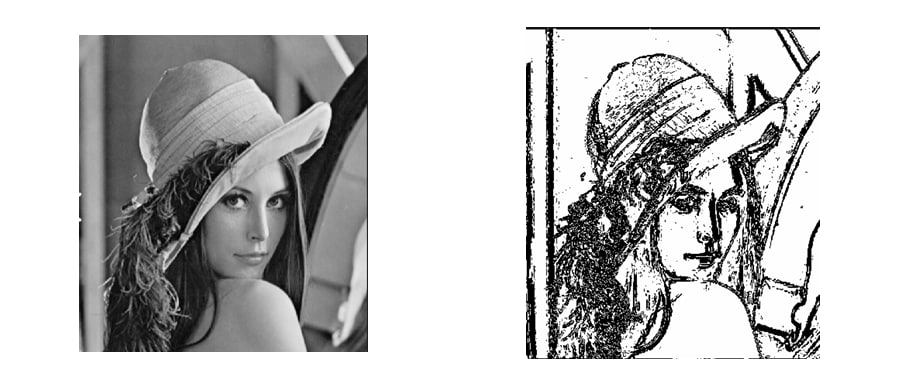

# Multithreaded Image‑Processing

The goal of this project is to develop a multithreaded image‑processing application that can apply filters to large images efficiently. The application divides an image into sub‑matrices, processes each part in parallel using multiple threads, and then reassembles the processed sub‑matrices into the final image. This approach leverages multithreading to improve the performance of image‑processing tasks.

### Objectives
1. **Load an image** – Read a single copy of the image into memory in the main thread; worker threads treat it as a shared resource.
2. **Divide the image** – Split the image into smaller, manageable sub‑matrices (chunks) and assign a specific range of the main matrix to each worker thread.
3. **Apply filters** – Implement various filters; each thread writes its results into its own matrix for its pixel range.
4. **Multithreading** – Process chunks in parallel using at least nine threads, chosen dynamically based on image size.
5. **Synchronization** – Without cloning the whole matrix, threads modify the shared image safely, ensuring neighbouring chunks don’t overwrite each other’s border pixels.
6. **Reassemble and save** – Merge all processed chunks back into a single image and write it to disk.

  

## Features
- **Sobel edge‑detection** for crisp edge maps.
- **Grayscale conversion** using efficient NumPy operations.
- **Adaptive thresholding** to create high‑contrast binary images.
- **Tile‑based multithreading** that scales with available CPU cores.
- **Batch mode** for applying all filters to every image in a folder.
